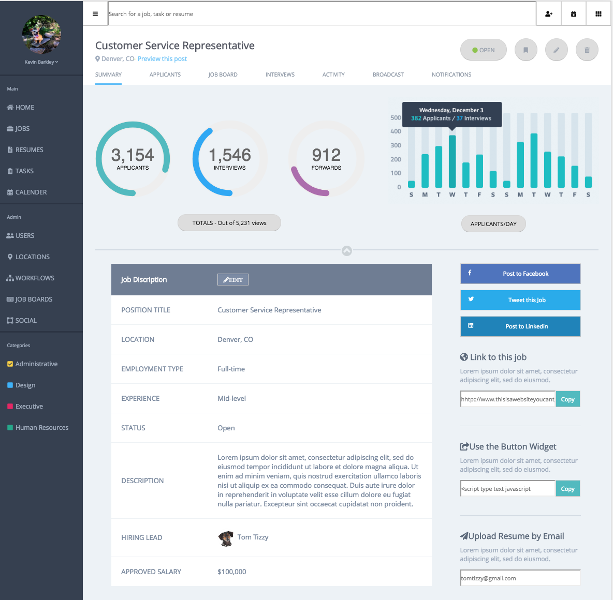

# BH-comp-challenge-3

For this challenge i was given a static comp and asked to recreate it without the help of any assets or images. I was asked to respect the designers choice in color, font, spacing, and imagery to the smallest detail. I had to mimick the appearance of functional design through intuitive features as well as a liquid design. The comp must work on all screen sizes and flow through screen variations. Great practice for responsize web design!

